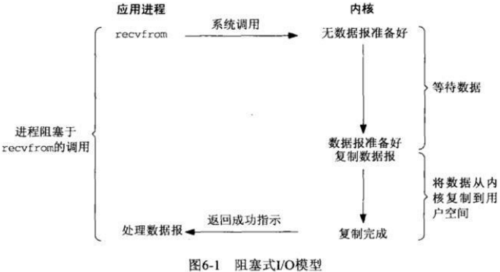

### UNIX下IO模型

1.同步和异步

同步与异步是线程之间的关系，两个线程同步操作时，调用者需要等待被调用者返回结果，之后进行下一步操作，异步则是不需要等待返回结果，即可进行下一步操作，被调用者通常依靠事件，回调等机制来通知调用者返回的结果。

2.阻塞和非阻塞

阻塞和非阻塞是同线程内的关系，一个线程在某个时刻，要么是阻塞的，要么是非阻塞的。
阻塞是指调用结果返回之前，当前线程被挂起，得到返回结果之后才可以继续执行。
非阻塞是指该线程在结果未返回之前，不会被挂起，可以继续执行。

四种组合：

同步阻塞：发送方发送请求之后一直等待响应，接收方处理请求，在得到返回结果之前将线程挂起。

同步非阻塞：发送方发送请求后一直等待响应，接收方处理请求，在得到返回结果之前，可以继续做其他的事情，发送方一直等待。等待发送完成之后，将状态和结果返回接收方，接收方再响应发送方	。

异步阻塞：发送方发送请求之后，不等待响应，可以继续干其他的事，接收方处理请求，再得到返回结果之前，一直等待结果返回，返回之后再响应发送方。

异步非阻塞：发送方发送请求之后，不等待响应，可以继续干其他的事，接收方处理请求，在得到结果之前，也可以干其他的事，当IO操作完成之后，将完成的状态和结果通知接收方，之后响应发送方

|IO操作分为两个阶段：
|1.数据准备阶段     2.内核空间复制数据到用户空间阶段

Unix下的五种IO模型：

阻塞IO：一个进程recvfrom开始IO之后，它的系统调用直到数据包到达且被复制到用户空间或者中间发生了错误才会返回。进程从调用recvfrom开始到它返回成功这整个过程都是阻塞的。如图：

非阻塞IO：从recvfrom调用开始，内核如果无数据报准备（缓存没有数据），就会返回一个EWOULDBLOCK错误，然后recvfrom一直检查有无数据到来。(一般不使用)

IO复用：IO复用与非阻塞IO有点像，因为非阻塞IO会花费大量的CPU资源去轮询，而且可能有很多的任务同时进行，人们就想到了循环查询多个任务的完成状态，有一个任务完成，就去处理这个任务。Unix下的select，poll和epoll就是做这个事情的，netty就是基于epoll实现的。

信号驱动IO：首先允许开启套接口信号驱动IO功能，通过系统调用sigaction执行一个函数，调用之后立即返回，进程继续执行，当内核中数据报准备好之后，会为该进程生成一个SIGIO信号，告诉进程准备好了，可以来读取数据了。

异步IO：告知内核我要进行IO操作，并让内核在整个操作完成之后通知我们，在内核准备和复制数据报期间，进程继续执行。这个和上面的信号驱动相比主要区别是，信号驱动告诉进程什么时候可以进行IO操作，而异步IO是告诉进程IO操作何时完成的。

###select，poll，epoll

非阻塞IO，进程会时刻轮询来达到处理多个流的目的，但是如果所有的流中都没有数据，那么就会白白的浪费CPU，为了避免CPU空转，就引进了一个代理select，它可以同时观察许多流的IO事件，进程会阻塞在select，当有一个或者多个流有IO事件时，select就会醒来，把所有的IO都轮询一遍，进行IO操作。使用select，事件复杂度就是O(n)，32位默认连接数是1024，64位默认是2048。

poll和select类似，将用户传入的数组拷贝到内核空间，然后查询每个fd对应的设备状态。poll没有最大连接数的限制，因为它是基于链表来存储的。它的缺点是大量的数组从用户到内核之间复制，不管这样有没有意义。

epoll通过epoll_create,epoll_ctl和epoll_wait三个函数实现的。

epoll_create是在内核创建一个epoll相关的列结构，并且将fd返回用户态。

epoll_ctl是将fd添加/删除在epoll_epfd中，epoll_event是用户态和内核态交互的结构，定义了用户态的事件类型和数据载体epoll_data。也就是告诉内核哪些fd需要做哪些操作。

epoll_wait是阻塞等待内核返回的可读写事件，epfd还是epoll_create的返回值，events是结构体指针存储epoll_event,就是讲所有待处理的epoll_event结构存储下来，maxevents告诉内核本次返回的最大fd数量，这个和events指向的数组是相关的。也就是调用epoll_wati等待内核反馈的可读写事件并处理。

### Java IO

java io就是输入输出，从数据源读取以及输出到目标媒介。常见的数据源和目标媒介就是：文件，管道，网络连接，内存缓存等。

##### 流

Java IO中，流是一个核心概念，流是指一个连续的数据流，既可以从流中读取数据，也可以写入数据。在Java IO中，流可以是字符流（以字符为单位），也可以是字节流（以字节为单位）。

##### Java IO的用途

Java IO包含了InputStream，Reader，OutputStream，Writer以及它们的子类，每一个类提供不同的功能。这些类的主要作用就是：文件访问，网络访问，内存缓存访问，线程内部通信，缓冲，过滤，解析，读写文本，读写基本数据类型，读写对象。

